- [Repository Information](#orge054329)
  - [Description](#org3a39aa8)
- [Images](#org64c8433)
- [Usage Instructions](#org4f9acfe)
- [Build Instructions](#orge8e5635)
- [Hardware](#orgeb8ccaa)
  - [backlight\_controller\_3x2](#orgca50115)
    - [Repository Information](#org5927fcf)
    - [Images](#org69327af)
    - [Schematic](#orge33ede9)
    - [Gerbers](#orgf797ecf)
    - [Bill of Materials](#org85fc626)
    - [Supplemental Documentation](#orgcb5742b)
  - [backlight\_controller\_5x3](#org00369fb)
    - [Repository Information](#org8fb74d3)
    - [Images](#org65a8330)
    - [Schematic](#org0d846bf)
    - [Gerbers](#orgfa74677)
    - [Bill of Materials](#orgdee98c0)
    - [Supplemental Documentation](#org80b6d0d)
- [Firmware](#org0f704cf)
  - [BacklightController](#org1c6445e)
    - [Library Information](#org626a770)
    - [API NAMES](#orge00f319)
    - [API GENERAL](#orgb80ab36)
    - [Ancestors](#orga1c6bae)
    - [Clients](#org7e6e8fe)
    - [Devices](#org3e79a14)
    - [More Detailed Modular Device Information](#orgba2406c)
    - [Installation Instructions](#org7a1dad9)


<a id="orge054329"></a>

# Repository Information

-   **Name:** smart\_vision\_controller
-   **Version:** 1.0
-   **License:** BSD, Open-Source Hardware
-   **URL:** <https://github.com/janelia-modular-devices/smart_vision_controller>
-   **Author:** Peter Polidoro
-   **Email:** peter@polidoro.io


<a id="org3a39aa8"></a>

## Description

This&#x2026;


<a id="org64c8433"></a>

# Images


<a id="org4f9acfe"></a>

# Usage Instructions

-   First&#x2026;


<a id="orge8e5635"></a>

# Build Instructions

-   First&#x2026;


<a id="orgeb8ccaa"></a>

# Hardware


<a id="orgca50115"></a>

## backlight\_controller\_3x2


<a id="org5927fcf"></a>

### Repository Information

-   **Name:** backlight\_controller\_3x2
-   **Version:** 1.2
-   **License:** Open-Source Hardware
-   **URL:** <https://github.com/janelia-kicad/backlight_controller_3x2>
-   **Author:** Peter Polidoro
-   **Email:** peter@polidoro.io

1.  Description

    This board controls one Smart Vision backlight with IR and visible channels plus additional high and low power channel outputs.


<a id="org69327af"></a>

### Images


<a id="orge33ede9"></a>

### Schematic

[./hardware/backlight\_controller\_3x2/schematic/backlight\_controller\_3x2.pdf](./hardware/backlight_controller_3x2/schematic/backlight_controller_3x2.pdf)

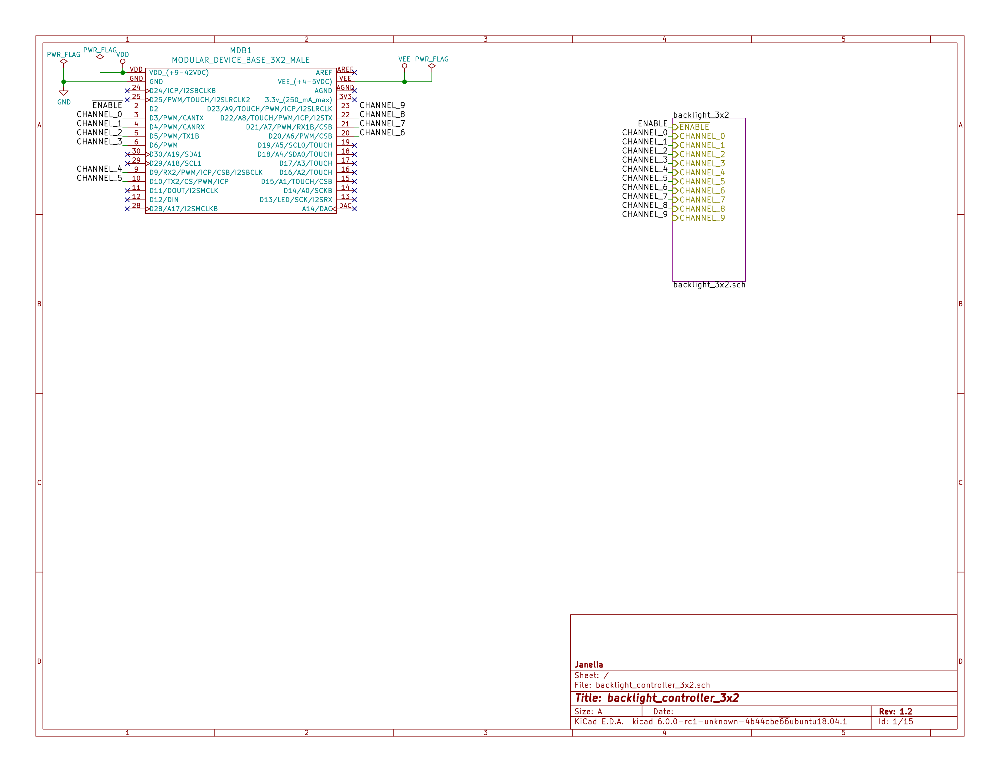

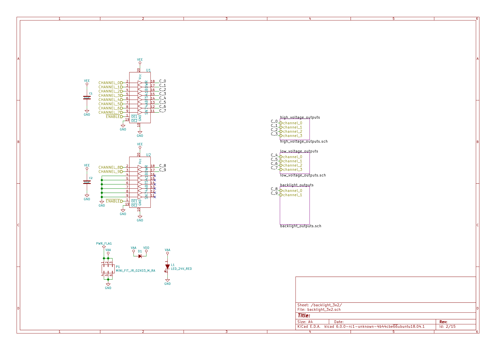


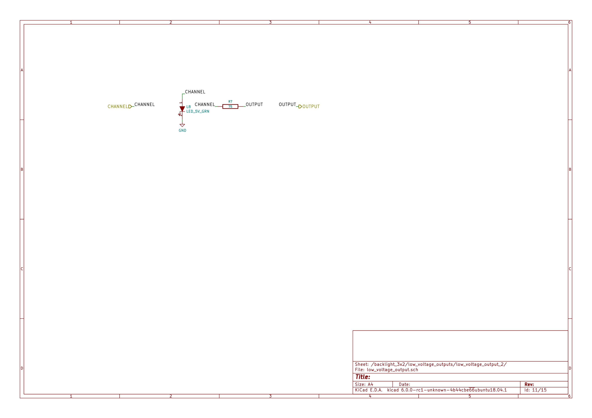


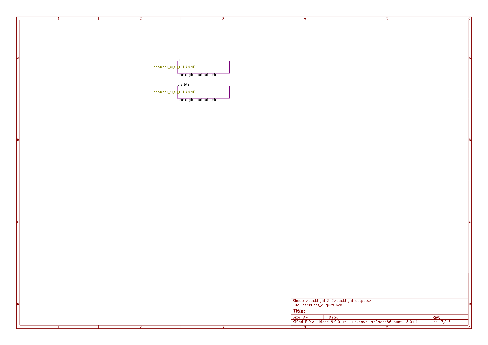

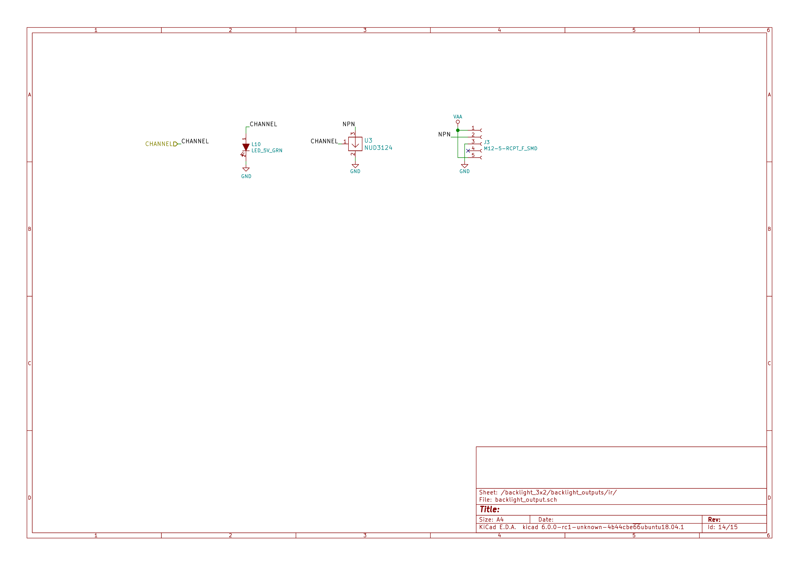


<a id="orgf797ecf"></a>

### Gerbers

Send gerbers zip file to your favorite PCB manufacturer for fabrication.

[./hardware/backlight\_controller\_3x2/gerbers/backlight\_controller\_3x2\_v1.2.zip](./hardware/backlight_controller_3x2/gerbers/backlight_controller_3x2_v1.2.zip)

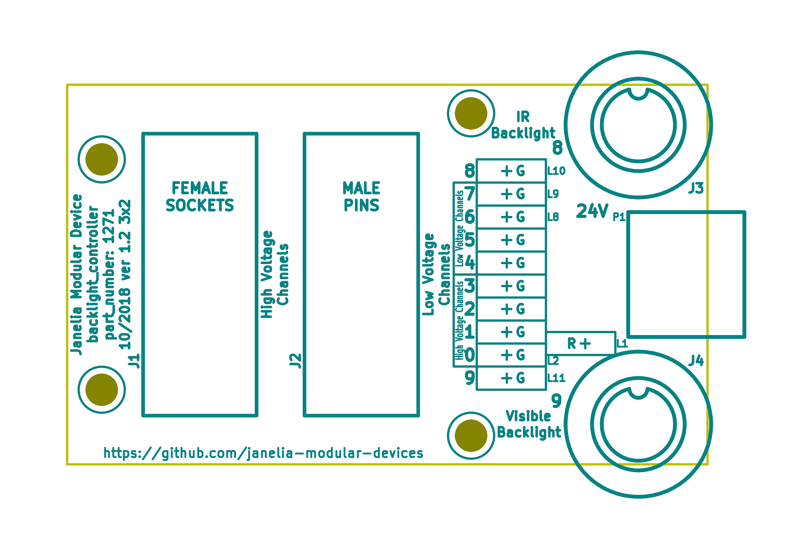

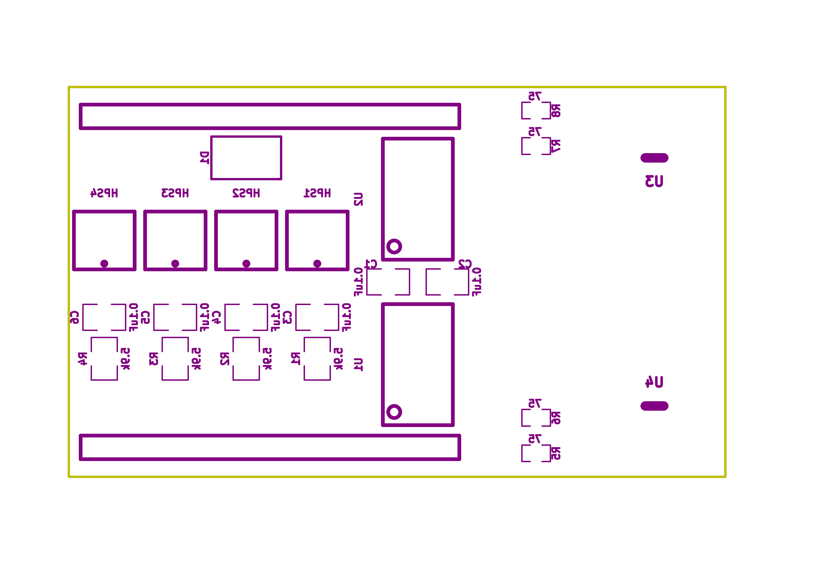


<a id="org85fc626"></a>

### Bill of Materials

1.  PCB Parts

    | Item | Reference(s)                    | Quantity | PartNumber         | Vendor  | Description                                                               |
    |---- |------------------------------- |-------- |------------------ |------- |------------------------------------------------------------------------- |
    | 1    | C1 C2 C3 C4 C5 C6               | 6        | 399-13229-1-ND     | digikey | CAP CER 0.1UF 50V 10% X7R 1210                                            |
    | 2    | D1                              | 1        | 568-11697-1-ND     | digikey | DIODE SCHOTTKY 45V 10A CFP15                                              |
    | 3    | HPS1 HPS2 HPS3 HPS4             | 4        | BTS3256DAUMA1CT-ND | digikey | IC SWITCH SMART LOWSIDE TO252-5                                           |
    | 4    | J1                              | 1        | 1195-4005-1-ND     | digikey | CONN D-SUB RCPT 9POS SMD SOLDER                                           |
    | 5    | J2                              | 1        | 1195-4006-1-ND     | digikey | CONN D-SUB PLUG 9POS SMD SOLDER                                           |
    | 6    | J3 J4                           | 2        | 277-10282-1-ND     | digikey | CONN FMALE INSERT 5POS SOLDER                                             |
    | 7    | L1                              | 1        | 350-1723-ND        | digikey | LED 2MM 24V VERTICAL RED PC MNT                                           |
    | 8    | L10 L11 L2 L3 L4 L5 L6 L7 L8 L9 | 10       | 350-1726-ND        | digikey | LED 2MM 5V VERTICAL GREEN PC MNT                                          |
    | 9    | MDB1                            | 2        | S1011E-16-ND       | digikey | 16 Position Header Through Hole Male Pins                                 |
    | 10   | P1                              | 1        | WM1353-ND          | digikey | CONN HEADER 6POS 4.2MM R/A TIN                                            |
    | 11   | R1 R2 R3 R4                     | 4        | P5.90KAACT-ND      | digikey | RES SMD 5.9k OHM 1% 1/2W 1210                                             |
    | 12   | R5 R6 R7 R8                     | 4        | P75.0CCT-ND        | digikey | RES SMD 75 OHM 1% 1/8W 0805                                               |
    | 13   | U1 U2                           | 2        | 296-14668-1-ND     | digikey | Buffer Non-Inverting 1 Element 8 Bit per Element Push-Pull Output 20-SOIC |
    | 14   | U3 U4                           | 2        | NUD3124LT1GOSCT-ND | digikey | IC INDCT LOAD DRVR AUTO SOT23                                             |

2.  Supplemental Parts

    | Item | Quantity | PartNumber   | Vendor  | Description                    |
    |---- |-------- |------------ |------- |------------------------------ |
    | 1    | 1        | 1866-2122-ND | digikey | AC/DC DESKTOP ADAPTER 24V 280W |
    | 2    | 1        | 1866-5006-ND | digikey | CORD IEC 320-C13 6FT BLACK     |
    | 3    | 2        | 277-10308-ND | digikey | CONN INSERT SHELL PRESS FIT    |

3.  Vendor Parts Lists

    [./hardware/backlight\_controller\_3x2/bom/digikey\_parts.csv](./hardware/backlight_controller_3x2/bom/digikey_parts.csv)

    [./hardware/backlight\_controller\_3x2/bom/supplemental\_digikey\_parts.csv](./hardware/backlight_controller_3x2/bom/supplemental_digikey_parts.csv)


<a id="orgcb5742b"></a>

### Supplemental Documentation

1.  Assembly Instructions

    -   Solder surface mount and through hole components onto the pcb.


<a id="org00369fb"></a>

## backlight\_controller\_5x3


<a id="org8fb74d3"></a>

### Repository Information

-   **Name:** backlight\_controller\_5x3
-   **Version:** 1.2
-   **License:** Open-Source Hardware
-   **URL:** <https://github.com/janelia-kicad/backlight_controller_5x3>
-   **Author:** Peter Polidoro
-   **Email:** peter@polidoro.io

1.  Description

    This board controls up to four Smart Vision backlights with IR and visible channels plus additional high and low power channel outputs.


<a id="org65a8330"></a>

### Images


<a id="org0d846bf"></a>

### Schematic

[./hardware/backlight\_controller\_5x3/schematic/backlight\_controller\_5x3.pdf](./hardware/backlight_controller_5x3/schematic/backlight_controller_5x3.pdf)

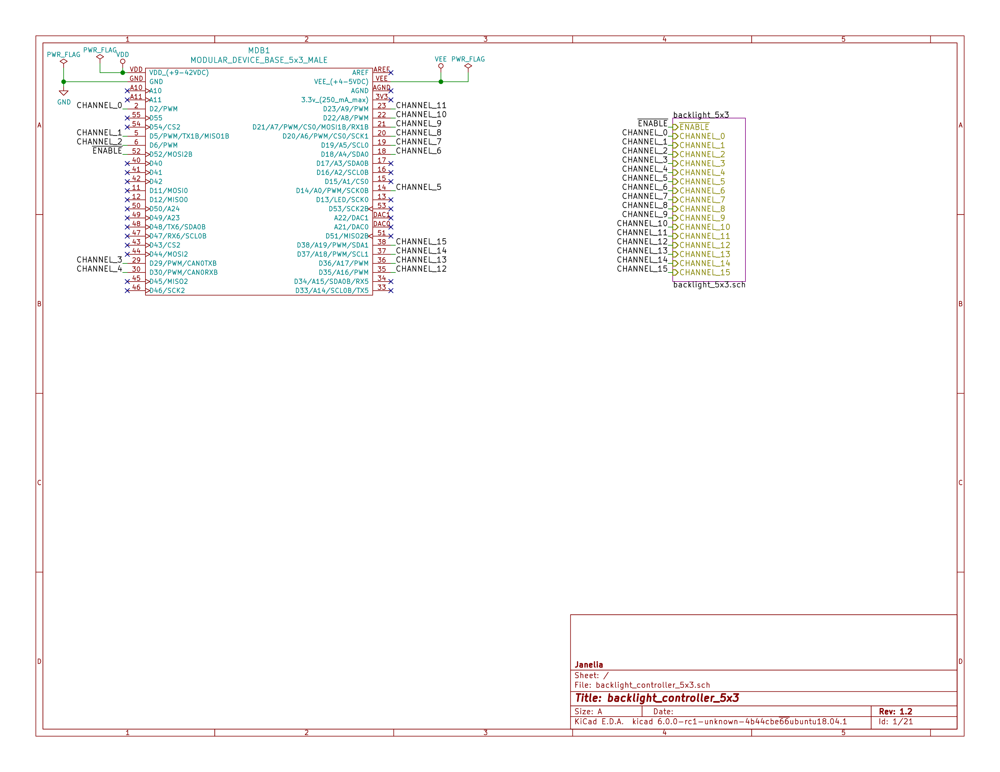

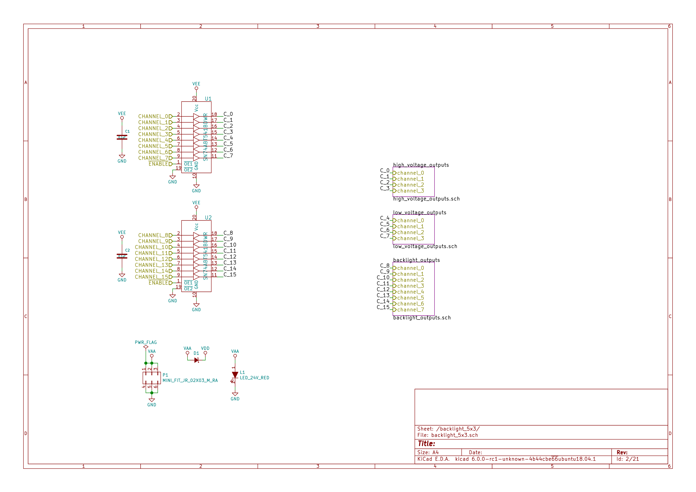

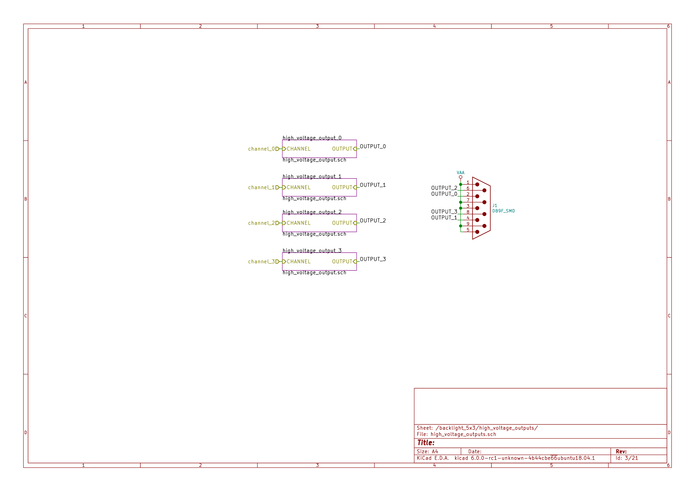


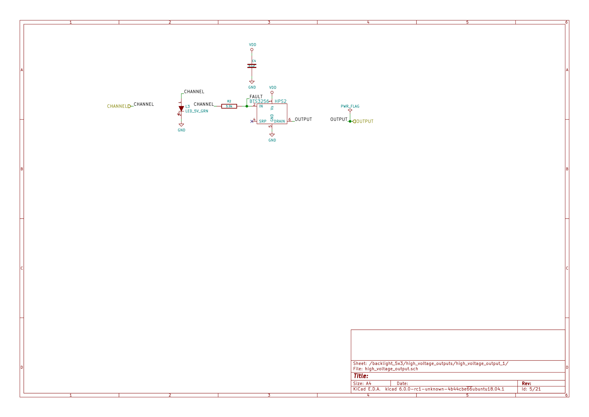


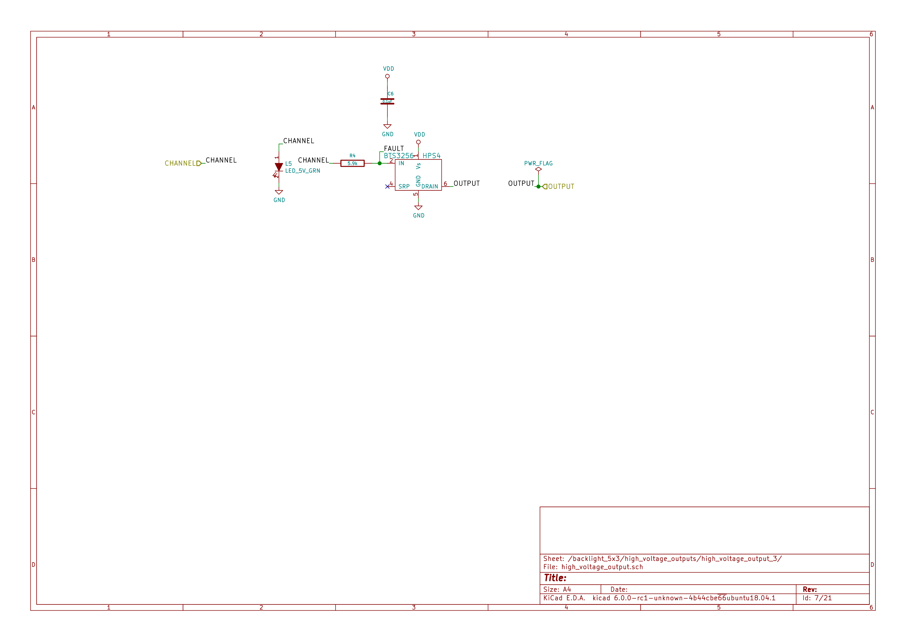

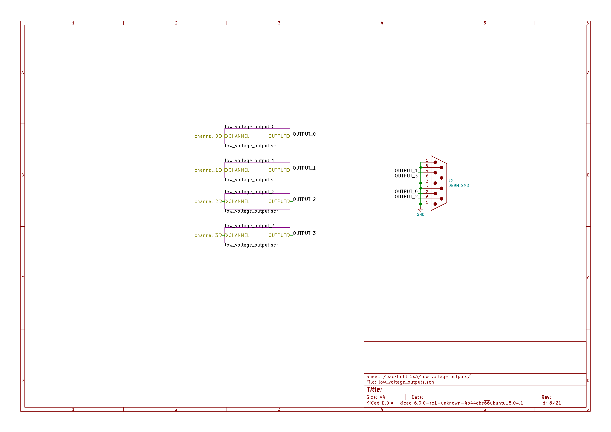


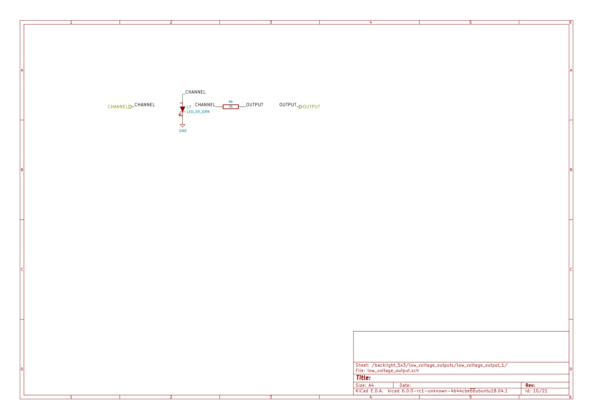


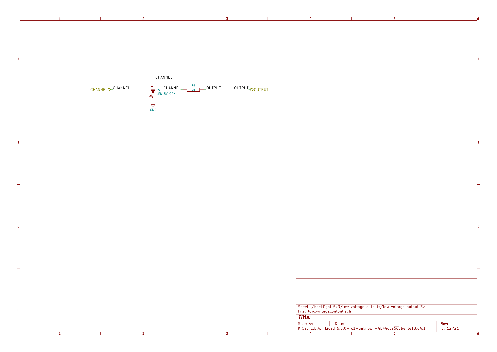

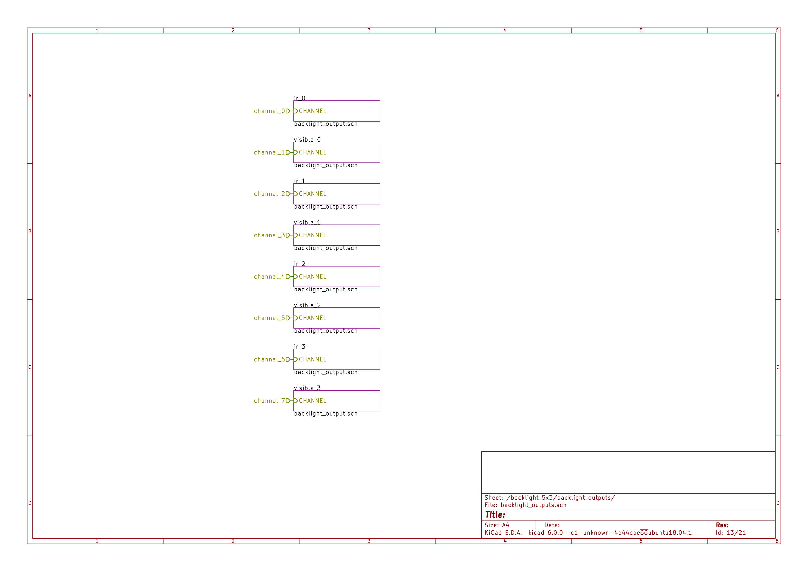


<a id="orgfa74677"></a>

### Gerbers

Send gerbers zip file to your favorite PCB manufacturer for fabrication.

[./hardware/backlight\_controller\_5x3/gerbers/backlight\_controller\_5x3\_v1.2.zip](./hardware/backlight_controller_5x3/gerbers/backlight_controller_5x3_v1.2.zip)

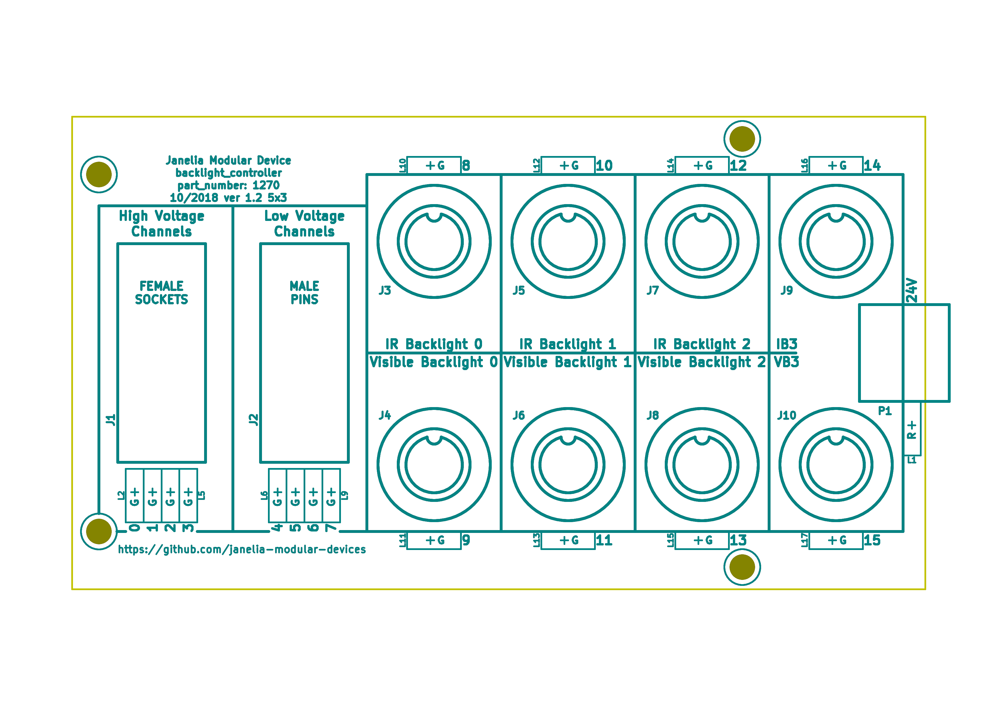

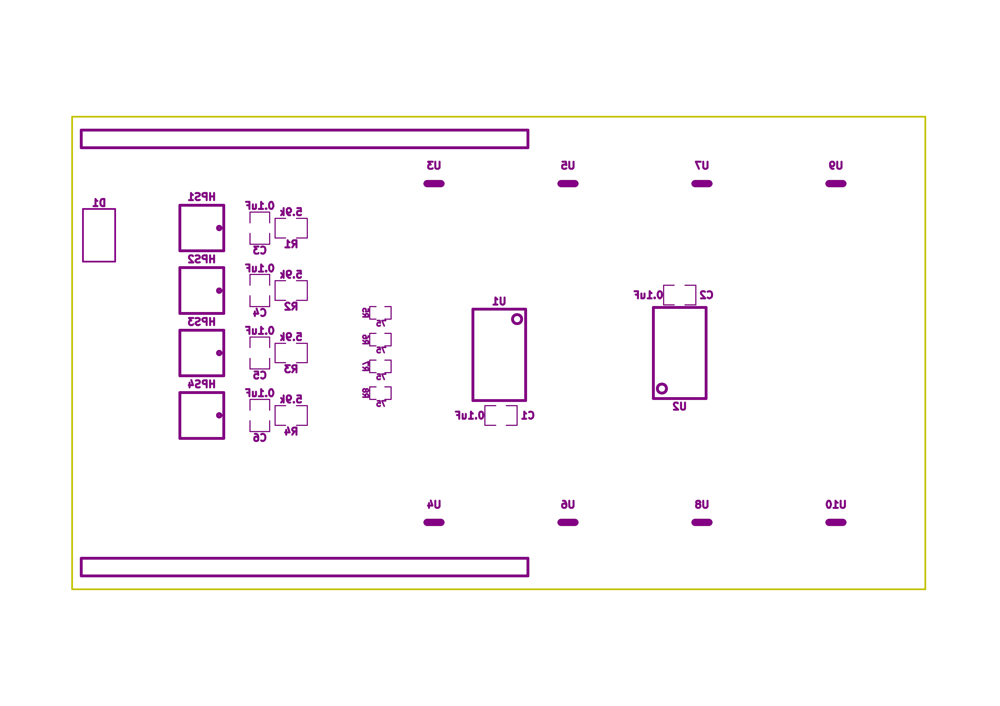


<a id="orgdee98c0"></a>

### Bill of Materials

1.  PCB Parts

    | Item | Reference(s)                                            | Quantity | PartNumber         | Vendor  | Description                                                               |
    |---- |------------------------------------------------------- |-------- |------------------ |------- |------------------------------------------------------------------------- |
    | 1    | C1 C2 C3 C4 C5 C6                                       | 6        | 399-13229-1-ND     | digikey | CAP CER 0.1UF 50V 10% X7R 1210                                            |
    | 2    | D1                                                      | 1        | 568-11697-1-ND     | digikey | DIODE SCHOTTKY 45V 10A CFP15                                              |
    | 3    | HPS1 HPS2 HPS3 HPS4                                     | 4        | BTS3256DAUMA1CT-ND | digikey | IC SWITCH SMART LOWSIDE TO252-5                                           |
    | 4    | J1                                                      | 1        | 1195-4005-1-ND     | digikey | CONN D-SUB RCPT 9POS SMD SOLDER                                           |
    | 5    | J10 J3 J4 J5 J6 J7 J8 J9                                | 8        | 277-10282-1-ND     | digikey | CONN FMALE INSERT 5POS SOLDER                                             |
    | 6    | J2                                                      | 1        | 1195-4006-1-ND     | digikey | CONN D-SUB PLUG 9POS SMD SOLDER                                           |
    | 7    | L1                                                      | 1        | 350-1723-ND        | digikey | LED 2MM 24V VERTICAL RED PC MNT                                           |
    | 8    | L10 L11 L12 L13 L14 L15 L16 L17 L2 L3 L4 L5 L6 L7 L8 L9 | 16       | 350-1726-ND        | digikey | LED 2MM 5V VERTICAL GREEN PC MNT                                          |
    | 9    | MDB1                                                    | 2        | S1011E-25-ND       | digikey | 25 Positions Header Breakaway Connector 0.1in                             |
    | 10   | P1                                                      | 1        | WM1353-ND          | digikey | CONN HEADER 6POS 4.2MM R/A TIN                                            |
    | 11   | R1 R2 R3 R4                                             | 4        | P5.90KAACT-ND      | digikey | RES SMD 5.9k OHM 1% 1/2W 1210                                             |
    | 12   | R5 R6 R7 R8                                             | 4        | P75.0CCT-ND        | digikey | RES SMD 75 OHM 1% 1/8W 0805                                               |
    | 13   | U1 U2                                                   | 2        | 296-14668-1-ND     | digikey | Buffer Non-Inverting 1 Element 8 Bit per Element Push-Pull Output 20-SOIC |
    | 14   | U10 U3 U4 U5 U6 U7 U8 U9                                | 8        | NUD3124LT1GOSCT-ND | digikey | IC INDCT LOAD DRVR AUTO SOT23                                             |

2.  Supplemental Parts

    | Item | Quantity | PartNumber   | Vendor  | Description                    |
    |---- |-------- |------------ |------- |------------------------------ |
    | 1    | 1        | 1866-2122-ND | digikey | AC/DC DESKTOP ADAPTER 24V 280W |
    | 2    | 1        | 1866-5006-ND | digikey | CORD IEC 320-C13 6FT BLACK     |
    | 3    | 8        | 277-10308-ND | digikey | CONN INSERT SHELL PRESS FIT    |

3.  Vendor Parts Lists

    [./hardware/backlight\_controller\_5x3/bom/digikey\_parts.csv](./hardware/backlight_controller_5x3/bom/digikey_parts.csv)

    [./hardware/backlight\_controller\_5x3/bom/supplemental\_digikey\_parts.csv](./hardware/backlight_controller_5x3/bom/supplemental_digikey_parts.csv)


<a id="org80b6d0d"></a>

### Supplemental Documentation

1.  Assembly Instructions

    -   Solder surface mount and through hole components onto the pcb.


<a id="org0f704cf"></a>

# Firmware


<a id="org1c6445e"></a>

## BacklightController


<a id="org626a770"></a>

### Library Information

-   **Name:** BacklightController
-   **Version:** 1.0.0
-   **License:** BSD
-   **URL:** <https://github.com/janelia-arduino/BacklightController>
-   **Author:** Peter Polidoro
-   **Email:** peter@polidoro.io

1.  Description

    Modular device backlight controller library.


<a id="orge00f319"></a>

### API NAMES

```js
{
  "id": "getApi",
  "result": {
    "firmware": [
      "BacklightController"
    ],
    "verbosity": "NAMES",
    "functions": [
      "setAllIrBacklightsOnAtPower",
      "setIrBacklightOn",
      "setIrBacklightOnAtPower",
      "setIrBacklightOff",
      "getIrBacklightPowersWhenOn",
      "getIrBacklightPowers",
      "setAllVisibleBacklightsOnAtPower",
      "setVisibleBacklightOn",
      "setVisibleBacklightOnAtPower",
      "setVisibleBacklightOff",
      "getVisibleBacklightPowersWhenOn",
      "getVisibleBacklightPowers",
      "setAllHighVoltagesOnAtPower",
      "setHighVoltageOn",
      "setHighVoltageOnAtPower",
      "setHighVoltageOff",
      "getHighVoltagePowersWhenOn",
      "getHighVoltagePowers",
      "setAllLowVoltagesOnAtPower",
      "setLowVoltageOn",
      "setLowVoltageOnAtPower",
      "setLowVoltageOff",
      "getLowVoltagePowersWhenOn",
      "getLowVoltagePowers"
    ],
    "parameters": [
      "ir_backlight",
      "visible_backlight",
      "high_voltage",
      "low_voltage"
    ],
    "properties": [
      "irBacklightPowerMax",
      "visibleBacklightPowerMax",
      "highVoltagePowerMax",
      "lowVoltagePowerMax"
    ],
    "callbacks": [
      "setAllIrBacklightsOn",
      "setAllIrBacklightsOff",
      "setAllVisibleBacklightsOn",
      "setAllVisibleBacklightsOff",
      "setAllHighVoltagesOn",
      "setAllHighVoltagesOff",
      "setAllLowVoltagesOn",
      "setAllLowVoltagesOff"
    ]
  }
}
```


<a id="orgb80ab36"></a>

### API GENERAL

<./firmware/BacklightController/api/>


<a id="orga1c6bae"></a>

### Ancestors

<https://github.com/janelia-arduino/ModularServer>

<https://github.com/janelia-arduino/ModularDeviceBase>

<https://github.com/janelia-arduino/DigitalController>


<a id="org7e6e8fe"></a>

### Clients


<a id="org3e79a14"></a>

### Devices

<https://github.com/janelia-modular-devices/modular_device_base>

<https://github.com/janelia-modular-devices/backlight_controller>


<a id="orgba2406c"></a>

### More Detailed Modular Device Information

<https://github.com/janelia-modular-devices/modular-devices>


<a id="org7a1dad9"></a>

### Installation Instructions

<https://github.com/janelia-arduino/arduino-libraries>
